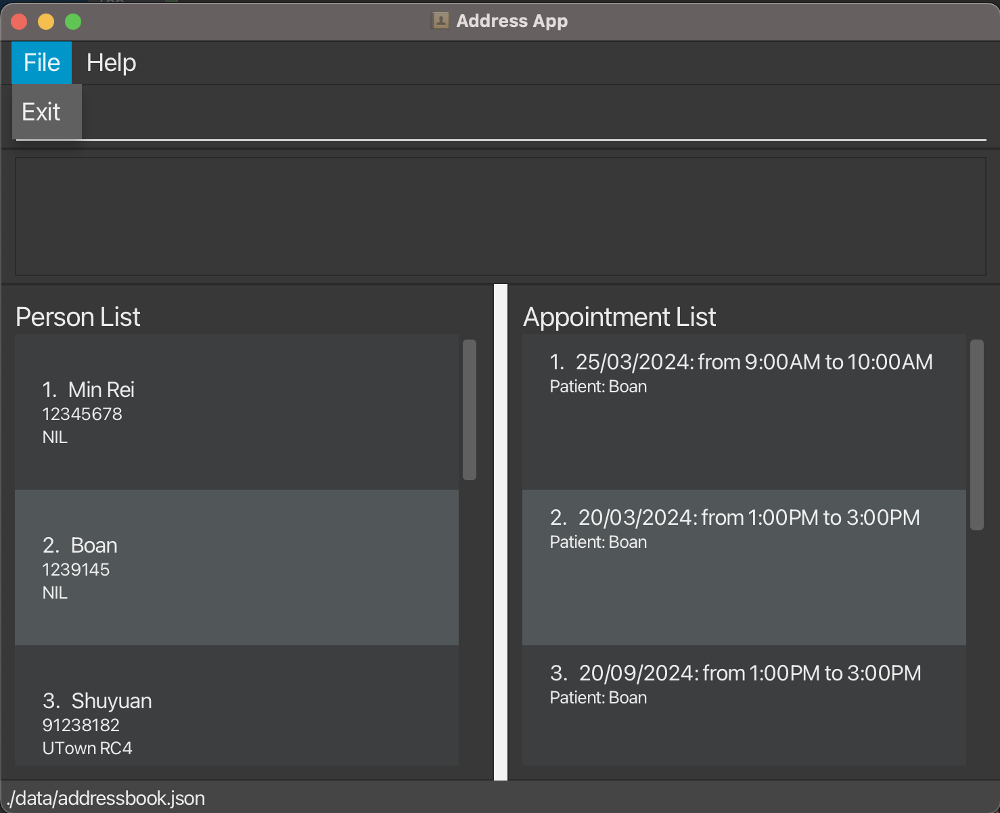

# Rapid Tracer

RapidTracer offers a fast-paced GUI for clinic managers to handle contacts and appointments. It combines:
- Simple and intuitive GUI
- Quick to use for fast typers
- Swiftly navigation through complex patient data and contact histories.
- A keyboard-driven interface that mirrors the efficiency of Vim
- The ability to load and store large datasets

This guide provides a quick summary of Rapid Tracer's features; click the links on the right for quick navigation!

<!-- * Table of Contents -->
<page-nav-print />

--------------------------------------------------------------------------------------------------------------------

## Quick start 

1. Ensure you have Java `11` or above installed in your Computer.
2. For detailed instructions, refer to the [CS2103T](https://nus-cs2103-ay2324s2.github.io/website/admin/programmingLanguages.html) website guidelines.

--------------------------------------------------------------------------------------------------------------------

## Using Rapid Tracer

The clinical workflow is separated into three steps with Rapid Tracer:
1. [In-processing patients](#patient-in-processing)
2. [Searching existing records](#searching-records)
3. [Updating existing records](#editing-records)

For features which don't fall into the above categories, refer [here](#general-help)

<h3 id="patient-in-processing">
  Registering patients and appointments
</h3>

There are three ways we can register new patients and schedule new appointments.

1. Use the `add` command to register a new patient.
2. Use the `addappt` command to schedule a new appointment for an existing patient.
3. Use the `add` command to register a new patient and schedule an appointment immediately.

#### Registering new patients: `add`

We can add new patients to our database with the `add` command. Each patient must minimally have a name and a phone number for administrative purposes.

Format: `add n/NAME p/PHONE_NUMBER [a/ADDRESS] [t/TAG]`

- Commands in [brackets] are optional parameters.
- The name to be added “NAME” can only contain alphanumeric characters.
- Parameters may be typed in any order.

#### Scheduling new appointments: `addappt`

We can schedule appointments for existing patients using the `addappt` command.

Format: `addappt INDEX d/DATE`

- Adds an appointment to the contact at the specified INDEX.
- INDEX is a positive integer displayed on the screen.
- The format of "DATE_TIME" is `dd/mm/yyyy [x]am-[y]pm`. Examples of accepted "DATE_TIME":
  - `24/03/2024 10am-2pm`
  - `24/03/2024 10AM-2PM`
  - `24/03/2024 10am - 2pm`
  - `today 10am-2pm` (this will create an appointment from 10am to 2pm with today's date)
  - `tdy 10am-2pm` (this will create an appointment from 10am to 2pm with today's date)

#### Managing walk-ins: `add`

For walk-in appointments, we can also create a new contact and add an appointment with a single command. This command automatically creates an appointment linked to the patient which is being added.

Format: `add n/NAME p/PHONE_NUMBER d/DATE_TIME [a/ADDRESS] [t/TAG]`

- Commands in [brackets] are optional parameters.
- The name to be added “NAME” can only contain alphanumeric characters.
- Parameters may be typed in any order.
- The format of "DATE_TIME" is `dd/mm/yyyy [x]am-[y]pm`. Examples of accepted "DATE_TIME":
  - `24/03/2024 10am-2pm`
  - `24/03/2024 10AM-2PM`
  - `24/03/2024 10am - 2pm`
  - `today 10am-2pm` (this will create an appointment from 10am to 2pm with today's date)
  - `tdy 10am-2pm` (this will create an appointment from 10am to 2pm with today's date)

<h3 id="searching-records">
  Searching existing records
</h3>

Rapid Tracer offers search functions for both patient and appointment data. Beyond searching for specific patients and appointments, Rapid Tracer offers a list view to see all patient and appointment records.

#### Searching for contacts: `find`

Shows a list of contacts in RapidTracer matching the keywords provided. The contact only needs to partially match any of the keywords provided.

Format: `find KEYWORD [MORE_KEYWORDS]`

- The KEYWORD searched is case-insensitive.
- Order of keywords does not matter.
- Possible keyword types:
  - NAME
  - PHONE_NUMBER
  - ADDRESS

#### Finding appointment: `findappt`

Shows a list of appointments in RapidTracer matching the keywords provided. The appointment only needs to partially match any of the keywords provided.

Format: `findappt KEYWORD [MORE_KEYWORDS]`

- The KEYWORD searched is case-insensitive.
- Order of keywords does not matter.
- Possible keyword types:
  - NAME

#### Listing contacts: `list`

Shows a list of all contacts in RapidTracer.

Format: `list`

#### Listing appointments: `listappt`

Shows a list of all appointments in RapidTracer.

Format: `listappt`

<h3 id="editing-records">
  Editing and deleting records
</h3>

In the event that patients update their contact details or reschedule an appointment, their details can be updated accordingly. We can also cancel appointments and delete patient records.

#### Editing contact: `edit`

An existing patient's details can be updated in Rapid Tracer using the `edit` command. This does not deal with user appointments.

Format: `edit INDEX [n/NAME] [p/PHONE_NUMBER] [a/ADDRESS] [t/TAG]`

- Edits the contact at the specified INDEX.
- INDEX is a positive integer that is currently displayed on the screen.
- Only one INDEX can be edited at a time.
- At least one of the optional fields must be provided.
- Existing values will be updated to the input values.

#### Editing appointment: `editappt`

An appointment can be rescheduled with the `editappt` command to change the date and time of the appointment.

Format: `editappt INDEX d/DATE_TIME`

- INDEX is a positive integer that is currently displayed on the screen.
- Only one INDEX can be edited at a time.
- At least one of the optional fields must be provided.
- Existing values will be updated to the input values.
- The format of "DATE_TIME" is `dd/mm/yyyy [x]am-[y]pm`. Examples of accepted "DATE_TIME":
  - `24/03/2024 10am-2pm`
  - `24/03/2024 10AM-2PM`
  - `24/03/2024 10am - 2pm`
  - `today 10am-2pm` (this will create an appointment from 10am to 2pm with today's date)
  - `tdy 10am-2pm` (this will create an appointment from 10am to 2pm with today's date)

#### Deleting contacts: `delete`

In the event that a patient requests for their data to be deleted, we can use the `delete` command to remove their contact information.

Format: `delete INDEX`

- Deletes the contact at the specified INDEX.
- INDEX is a positive integer that is currently displayed on the screen.
- Only one INDEX can be deleted at a time.

#### Deleting appointment: `deleteappt`

In the event that an appointment is cancelled, we can delete it using the `deleteappt` command.

Format: `deleteappt INDEX`

- Deletes the appointment at the specified INDEX.
- INDEX is a positive integer that is currently displayed on the screen.
- Only one INDEX can be deleted at a time.

<h3 id="general-help">
  General help
</h3>

#### Viewing help: `help`

For general help, type `help` to open the help window. The `help` window will redirect you [here](https://se-education.org/addressbook-level3/UserGuide.html).

Format: `help`

#### Exiting/closing Rapid Tracer

To properly exit Rapid Tracer, click the `File` option in the top left corner and click `Exit`. This will ensure that the data is saved properly. 

--------------------------------------------------------------------------------------------------------------------

## FAQ

**Q**: How do I upload records into Rapid Tracer? 
**A**: This feature is currently under development!

**Q**: How do I download all my records from Rapid Tracer? 
**A**: This feature is currently under development!

**Q**: A command is not working, what am I doing wrong? 
**A**: There's a chance that the feature is still under development. We will fix it!

--------------------------------------------------------------------------------------------------------------------

## Known issues

1. **When using multiple screens**, if you move the application to a secondary screen, and later switch to using only the primary screen, the GUI will open off-screen. The remedy is to delete the `preferences.json` file created by the application before running the application again.

--------------------------------------------------------------------------------------------------------------------

## Command summary

Action     | Format, Examples
-----------|----------------------------------------------------------------------------------------------------------------------------------------------------------------------
Add contacts | `add n/NAME p/PHONE_NUMBER [a/ADDRESS] [t/TAG]`
Add appointments | `addappt INDEX d/DATE_TIME`
Find contacts | `find KEYWORD [MORE_KEYWORDS]`
Find appointments | `findappt KEYWORD [MORE_KEYWORDS]`
List all contacts | `list`
List all appointments | `listappt`
Editing contacts | `edit INDEX [n/NAME] [p/PHONE_NUMBER] [a/ADDRESS] [t/TAG]`
Editing appointments | `editappt INDEX d/DATE_TIME`
Help | `help`