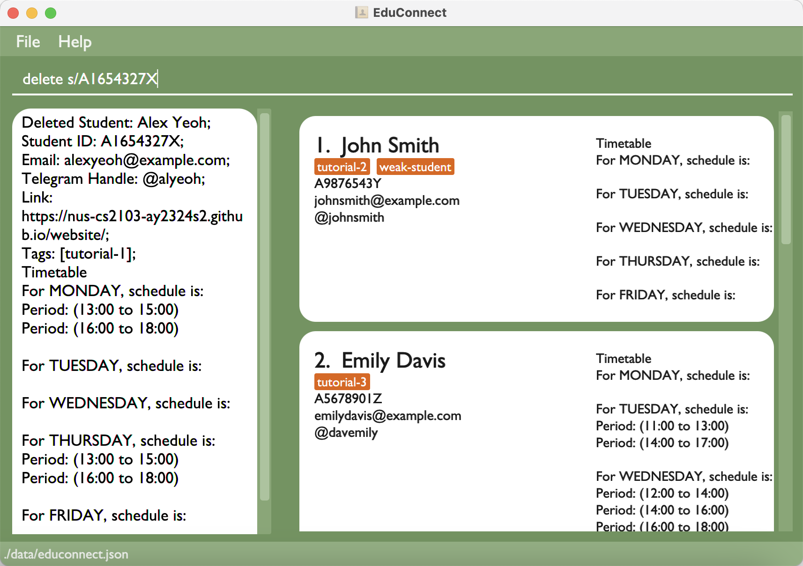

# EduConnect User Guide

EduConnect is a **desktop app for managing student contacts, optimized for use via a Command Line Interface (CLI)** while still having the benefits of a Graphical User Interface (GUI). If you can type fast, EduConnect can get your contact management tasks done faster than traditional GUI apps.

<!-- * Table of Contents -->
- [EduConnect User Guide](#educonnect-user-guide)
  - [Quick start](#quick-start)
  - [Features](#features)
    - [Viewing help : `help`](#viewing-help--help)
    - [Adding a student: `add`](#adding-a-student-add)
    - [Listing all students : `list`](#listing-all-students--list)
    - [Editing a student : `edit`](#editing-a-student--edit)
    - [Locating students by name: `find`](#locating-students-by-name-find)
    - [Deleting a student : `delete`](#deleting-a-student--delete)
    - [Clearing all entries : `clear`](#clearing-all-entries--clear)
    - [Exiting the program : `exit`](#exiting-the-program--exit)
    - [Saving the data](#saving-the-data)
    - [Editing the data file](#editing-the-data-file)
    - [Archiving data files `[coming in v2.0]`](#archiving-data-files-coming-in-v20)
  - [FAQ](#faq)
  - [Known issues](#known-issues)
  - [Command summary](#command-summary)

<page-nav-print />

--------------------------------------------------------------------------------------------------------------------

## Quick start

1. Ensure you have Java `11` or above installed in your Computer.

1. Download the latest `educonnect.jar` from [here](https://github.com/AY2324S2-CS2103-T14-1/tp/releases).

1. Copy the file to the folder you want to use as the _home folder_ for EduConnect.

1. Open a command terminal, `cd` into the folder you put the jar file in, and use the `java -jar educonnect.jar` command to run the application. 
   A GUI similar to the below should appear in a few seconds.  
   

1. Type the command in the command box and press Enter to execute it. e.g. typing **`help`** and pressing Enter will open the help window. 
   Some example commands you can try:

   * `list` : Lists all contacts.

   * `add n/John Doe s/A1234567X h/@john.doe e/johnd@example.com t/tutorial-1 t/high-ability` : Adds a contact named `John Doe` to the Address Book.

   * `delete 3` : Deletes the 3rd contact shown in the current list.

   * `clear` : Deletes all contacts.

   * `exit` : Exits the app.

1. Refer to the [Features](#features) below for details of each command.

--------------------------------------------------------------------------------------------------------------------

## Features

<box type="info" seamless>

**Notes about the command format:** 

* Words in `UPPER_CASE` are the parameters to be supplied by the user. 
  e.g. in `add n/NAME`, `NAME` is a parameter which can be used as `add n/John Doe`.

* Items in square brackets are optional. 
  e.g `n/NAME [t/TAG]` can be used as `n/John Doe t/friend` or as `n/John Doe`.

* Items with `…`​ after them can be used multiple times including zero times. 
  e.g. `[t/TAG]…​` can be used as ` ` (i.e. 0 times), `t/friend`, `t/friend t/family` etc.

* Parameters can be in any order. 
  e.g. if the command specifies `n/NAME p/PHONE_NUMBER`, `p/PHONE_NUMBER n/NAME` is also acceptable.

* Extraneous parameters for commands that do not take in parameters (such as `help`, `list`, `exit` and `clear`) will be ignored. 
  e.g. if the command specifies `help 123`, it will be interpreted as `help`.

* If you are using a PDF version of this document, be careful when copying and pasting commands that span multiple lines as space characters surrounding line-breaks may be omitted when copied over to the application.
</box>

### Viewing help : `help`

Shows a message explaning how to access the help page.

Format: `help`

### Adding a student: `add`

Adds a student to the address book.

Format: `add n/NAME s/STUDENT_ID e/EMAIL h/TELEGRAM_HANDLE [t/TAG]…​`

<box type="tip" seamless>

**Tip:** A student can have any number of tags (including 0)
</box>

Examples:
* `add n/John Doe s/A1234567X h/@john.doe e/johnd@example.com t/tutorial-1 t/high-ability`
* `add n/Anne-Marie Rose Nicholson t/singer t/songwriter e/rockabye@friends.uk h/@AnneMarieofficial s/A7041991U`

### Listing all students : `list`

Shows a list of all students in the address book.

Format: `list`

### Editing a student : `edit`

Edits an existing student in the address book.

Format: `edit INDEX [n/NAME] [s/STUDENT_ID] [e/EMAIL] [h/TELEGRAM_HANDLE] [t/TAG]…​`

* Edits the student at the specified `INDEX`. The index refers to the index number shown in the displayed student list. The index **must be a positive integer** 1, 2, 3, …​
* At least one of the optional fields must be provided.
* Existing values will be updated to the input values.
* When editing tags, the existing tags of the student will be removed i.e adding of tags is not cumulative.
* You can remove all the student’s tags by typing `t/` without
    specifying any tags after it.

Examples:
*  `edit 1 s/A0001234A e/johndoe@example.com` Edits the student id and email address of the 1st student to be `A0001234A` and `johndoe@example.com` respectively.
*  `edit 2 n/Betsy Crower t/` Edits the name of the 2nd student to be `Betsy Crower` and clears all existing tags.

### Locating students by name: `find`

Find students whose names contain any of the given keywords.

Format: `find KEYWORD [MORE_KEYWORDS]`

* The search is case-insensitive. e.g `hans` will match `Hans`
* The order of the keywords does not matter. e.g. `Hans Bo` will match `Bo Hans`
* Only the name is searched.
  * Students with names matching any parts of the keyword will be returned.
    e.g. `Hans Bo` will return `Hans Gruber`, `Bo Yang`,`J` will return `John Doe`, `Jimmy Lim`.

Examples:
* `find John` returns `john` and `John Doe`
* `find alex david` returns `Alex Yeoh`, `David Li` 
  

### Deleting a student : `delete`

Deletes a specified student from the address book.

Format: `delete [s/STUDENT_ID] [e/EMAIL] [h/TELEGRAM_HANDLE]`

* Deletes a student with the specified `STUDENT_ID` or `EMAIL` or `TELEGRAM_HANDLE`.
* Only one field may be used for each delete command.
* `NAME` or `TAG` may not be used.

Examples:
* `delete e/royb@gmail.com` deletes a student with an email of `royb@gmail.com` in the address book.
* `delete s/A1654327X` deletes a student with a student id of `A1654327X` in the address book.
  

### Clearing all entries : `clear`

Clears all entries from the address book.

Format: `clear`

### Exiting the program : `exit`

Exits the program.

Format: `exit`

### Saving the data

EduConnect data are saved in the hard disk automatically after any command that changes the data. There is no need to save manually.

### Editing the data file

EduConnect data are saved automatically as a JSON file `[JAR file location]/data/educonnect.json`. Advanced users are welcome to update data directly by editing that data file.

<box type="warning" seamless>

**Caution:**
If your changes to the data file makes its format invalid, EduConnect will discard all data and start with an empty data file at the next run.  Hence, it is recommended to take a backup of the file before editing it. 
Furthermore, certain edits can cause the EduConnect to behave in unexpected ways (e.g., if a value entered is outside the acceptable range). Therefore, edit the data file only if you are confident that you can update it correctly.
</box>

### Archiving data files `[coming in v2.0]`

_Details coming soon ..._

--------------------------------------------------------------------------------------------------------------------

## FAQ

**Q**: How do I transfer my data to another Computer? 
**A**: Install the app in the other computer and overwrite the empty data file it creates with the file that contains the data of your previous EduConnect home folder.

--------------------------------------------------------------------------------------------------------------------

## Known issues

1. **When using multiple screens**, if you move the application to a secondary screen, and later switch to using only the primary screen, the GUI will open off-screen. The remedy is to delete the `preferences.json` file created by the application before running the application again.

--------------------------------------------------------------------------------------------------------------------

## Command summary

Action     | Format, Examples
-----------|----------------------------------------------------------------------------------------------------------------------------------------------------------------------
**Add**    | `add n/NAME s/STUDENT_ID e/EMAIL h/TELEGRAM_HANDLE [t/TAG]…​`   e.g., `add n/James Ho s/A2222444X e/jamesho@example.com h/@hohoho t/struggling t/3rd year`
**Clear**  | `clear`
**Delete** | `delete [s/STUDENT_ID] [e/EMAIL] [h/TELEGRAM_HANDLE]`  e.g., `delete s/A1654327X`
**Edit**   | `edit INDEX [n/NAME] [s/STUDENT_ID] [e/EMAIL] [h/TELEGRAM_HANDLE] [t/TAG]…​`  e.g.,`edit 2 n/James Lee e/jameslee@example.com`
**Find**   | `find KEYWORD [MORE_KEYWORDS]`  e.g., `find James Jake`
**List**   | `list`
**Help**   | `help`
