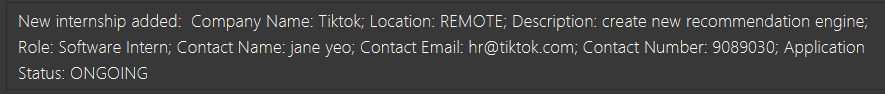
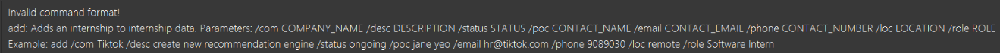
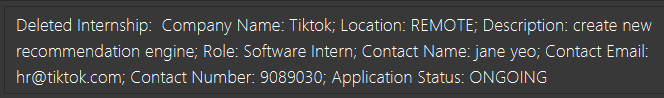

### Introduction
Welcome to CareerSync's User Guide!  

CareerSync is an **internship application manager designed to simplify the management of internship applications**. We're here to help 
you keep track of your internships, so you can focus on preparing for your interviews and securing your dream internship! :grin:

#### Who is CareerSync for?
CareerSync is **tailored to NUS Computing students** with **experience in command line interfaces (CLI)**.
Our app is driven by command inputs through the CLI, making it **faster than conventional GUI-based applications.** 

If you are a beginner, don't worry! Our [Quick Start](#quick-start) section will guide you through the installation of all the necessary tools, even if you have never used a CLI before.

#### What is the purpose of this User Guide?
This user guide was created to help students starting out with CareerSync get started with using our application quickly!

**For first-time users**, we recommend starting at the [Quick Start](#quick-start) section to install CareerSync, before heading to the [Tutorial](#tutorial) section.

**For experienced users**, check out the [Commands](#commands) section for a quick reference. 

Do check out our [FAQ](#faq), [Known Issues](#known-issues) and [Glossary](#glossary) sections for more information!

#### What can students do with CareerSync?

As computing students, keeping track of all the internship applications we've made tends to be a hassle. 
With CareerSync, you can:
1. **Add** internships, along with details such as company name, description, status and more!
2. **Find** internships by keywords, making it easy to find the information you need.
3. **Manage tasks** for your applications and keep track of their individual deadlines.
And so much more!

### Table Of Contents

| Section                                 | When Should I Use This?                                                                 |
|-----------------------------------------|-----------------------------------------------------------------------------------------|
| [Quick Start](#quick-start)             | If you are using the application for the first time or need a refresher                 |
| [Interface Overview](#interface-overview) | If you would like to know more about the interface of the application                   |
| [Tutorial](#tutorial)                   | If you would like to learn how to use the application                                   |
| [Commands](#commands)                   | If you would like to know the capabilities of the application                           |
| [FAQ](#faq)                             | If you have any questions about the application                                         |
| [Known Issues](#known-issues)           | If you have a technical problem. We may have the solution!                              |
| [Command Summary](#command-summary)     | If you would like to find more information about a specific command                     |
| [Field Summary](#field-summary)         | If you would like to know more about the fields and its restrictions in the application |
| [Glossary](#glossary)                   | If you would like to know more about the terms used in the application                  |

### Legend
This User Guide contains coloured blocks that highlight important information!

    💡 Green blocks contain examples that you can follow on CareerSync yourself!

    ℹ️ Blue blocks contain tips to enhance your experience using CareerSync!

    ⚠️ 
Red blocks contain warnings to note when using CareerSync!

[Go to Table of Contents](#table-of-contents)

--------------------------------------------------------------------------------------------------------------------
### Quick Start
#### Installation
1. Ensure that you have [Java 11 or above](https://www.java.com/en/download/) installed on your computer if you are using Windows.
    - If you are using MacOS, follow the instructions [here](https://nus-cs2103-ay2324s2.github.io/website/admin/programmingLanguages.html) instead.
2. Download the latest `CareerSync.jar` file [here](https://github.com/AY2324S2-CS2103T-W11-1/tp/releases/tag/v1.2).
3. Make sure your [jar](#glossary) file is located in an empty folder.
4. Start CareerSync.
    - For **MacOS**:
        - Open up your Terminal by typing <kbd>Command</kbd> + <kbd>Space</kbd>, then type `Terminal` and <kbd>Enter</kbd>. 
        - Navigate to the folder containing your jar file using `cd`. If you are not sure how to use `cd`, refer to [this link](https://www.ibm.com/docs/en/aix/7.2?topic=directories-changing-another-directory-cd-command)! 
        - Enter `java -jar CareerSync.jar` and type <kbd>Enter</kbd>.
   - For **Windows**:
       - Open the folder containing `CareerSync.jar`.
       - Double-click on `CareerSync.jar` to start up our application!
5. The **Graphical User Interace** similar to the image below should pop up on your screen.

For more information on the interface, please refer to the [Interface Overview](#interface-overview) section.

--------------------------------------------------------------------------------------------------------------------
### Interface Overview

When you first start CareerSync, you will see this window. This is the main window of CareerSync, where you can view all your internship applications.

   * `add /com Tiktok /desc create new recommendation engine /status ongoing /poc jane yeo /email hr@tiktok.com
      /phone 90890301 /loc remote /role Software Intern` : Adds this internship entry to the CareerSync application.
#### Areas
The main window of CareerSync is divided into four main areas: the **Tab Area**, the **CLI**, the **Message Box** and the **Internship List Display**.

1. **Tab Area**: The Tab Area contains File and Help, which allows you to navigate its respective functions.
2. **CLI**: The Command Line Interface (CLI) is where you can input commands to interact with CareerSync.
3. **Message Box**: The Message Box displays messages to provide feedback to you.
4. **Internship List Display**: The Internship List Display displays the details of all your internship applications.

#### Internship Fields
The names of the fields for each internship application is as stated below. When you edit these fields, you will see the changes reflected in the display.
For the restrictions on what is accepted for each field, kindly refer to [Fields Summary](#fields-summary).

1. `INDEX` - The index of the internship application in the filtered list.
2. `COMPANY_NAME` - The name of the company you are applying to.
3. `ROLE` - The role you are applying for.
4. `STATUS` - The status of your application.
5. `DESCRIPTION` - A brief description of the internship.
6. `LOCATION` - The location of the internship.
7. `CONTACT_NAME` - The name of the contact person.
8. `CONTACT_EMAIL` - The email of the contact person.
9. `CONTACT_NUMBER` - The phone number of the contact person.

--------------------------------------------------------------------------------------------------------------------

### Tutorial
This section would guide you through the basic commands of CareerSync, and how to use them.

#### Clearing sample internship entries: `clear`

To begin using CareerSync, you should clear the sample internship entries that are present when you first start the 
application.

Key in the command `clear` in the CLI and press `Enter` to clear the sample internship entries.

💡 **Try It Out:** 

1. Input: 
   `clear` 
     

2. Successful Output after clearing entries: 
   
   There are no more internships in the list.

#### Adding an internship entry: `add`

Next, let us try to add an internship entry. 

💡 **Try It Out:** 

Key in the following command in the CLI: `add /com Tiktok /desc create new recommendation engine /status ongoing /poc jane yeo /email hr@tiktok.com
/phone 90890301 /loc remote /role Software Intern`

Successful output after adding the entry: 
   
   You can now see your new internship with the details you entered in the **Internship List Display!**

#### Editing an internship entry: `edit`

Oh no! You made a mistake in the email address of the contact person. Let's edit the email address.

💡 **Try It Out:** 
Key in the following command in the CLI: `edit 1 /email janeyeo@gmail.com`

Successful output after editing the entry: 

Your internship now has the updated email that you keyed in.

#### Find internship entries: `find`

Before you continue, add a few more internship entries using these commands:
1. `add /com Google /desc create new search engine /status to_apply /poc john tan /email johntan@gmail.com /phone 98765432 /loc local /role Software Intern`
2. `add /com Facebook /desc create new social media platform /status to_apply /poc jane tan /email facebookhr@gmail.com /phone 87654321 /loc remote /role Software Intern`

Successful output after adding the entries: 

Let's say you want to find all internships that you want to apply for, that give you a software intern role.
`find` is the command you need!

💡 **Try It Out:** 

Key in the following command in the CLI: `find withall /status to_apply /role Software Intern`

Successful output after finding all entries that satisfy the conditions: 

Your **Internship List Display** now only has all the internships satisfying both conditions.

#### Deleting an internship entry: `delete`
You decide that to no longer pursue the internship at Facebook. Let's delete that entry.

💡 **Try It Out:** 

Key in the following command in the CLI: `delete 2`

Successful output after deleting the entry: 

The Facebook internship entry has been removed, and is no longer present in your database.

#### Listing all internships: `list`
You used find to filter the internships. How do you see all the internships again?

💡 **Try It Out:** 

Key in the following command in the CLI: `list`

Successful output after listing: 

You now see all your internships. Your Tiktok internship, previously hidden, is now back in view.

#### Exiting the program: `exit`
You decide that you are done for the day. How do you exit the application and save the file?

💡 **Try It Out:** 

Key in the following command in the CLI: `exit`

Upon reopening the app: 

You now see all your internships that you have when you exited. Your data was saved!

#### Wrapping up the tutorial

This wraps up our tutorial! Hope you now have a better understanding of how to use CareerSync to manage your internship 
applications now.

Only **simple and common use cases** are covered in this tutorial. Please refer to the [Commands](#commands) section so that
you fully understand each command and their usage.

____________________________________________________________________________________________________________________
### Command Summary

| Action                                        | Description                              | Format |
|-----------------------------------------------|------------------------------------------|------------------------------------------|
| [add](#adding-an-entry-add)                   | Adds an Internship.                      | `add /com COMPANY_NAME /desc DESCRIPTION /status STATUS /poc CONTACT_NAME /email CONTACT_EMAIL /phone CONTACT_NUMBER /loc LOCATION_ENUM /role ROLE` |
| [delete](#deleting-an-internship-delete)      | Removes a Internship.                    | `delete INDEX` |
| [list](#listing-all-internships-list)         | Removes a Internship.                    | `list` |
| [edit](#editing-an-internship-edit)           | Modifies an existing Internship.         | `edit INDEX [/com COMPANY_NAME] [/poc CONTACT_NAME] [/email CONTACT_EMAIL] [/phone CONTACT_NUMBER] [/loc LOCATION_ENUM] [/status STATUS] [/desc DESCRIPTION] [/role ROLE` |
| [addremark](#adding-a-remark-addremark)       | Adds a remark to an existing Internship. | `addremark INDEX [/remark REMARK]` |
| [clear](#clearing-all-internships-clear)      | Removes all Internships from the deck.   | `clear` |
| [find](#finding-internships-by-keywords-find) | Finds an Internship by keywords.         |`find MODE [/com COMPANY_NAME_KEYWORDS] [/poc CONTACT_NAME_KEYWORDS] [/loc LOCATION_KEYWORDS] [/status STATUS_KEYWORDS] [/desc DESCRIPTION_KEYWORDS] [/role ROLE_KEYWORDS]`|
| [sort](#sorting-internships-by-fields-sort)   | Sorts the Internships by fields.         | `sort FIELD ORDER` |
| [exit](#exiting-the-program-exit)             | Exits and closes the application.        | `exit` |

--------------------------------------------------------------------------------------------------------------------
### Commands

**Notes about the command format** 

* `INDEX` refers to the index of the internship in the list, and is be a positive integer 1, 2, 3 …

* Items in square brackets are optional. 
  e.g `/com COMPANY_NAME [/poc NAME_OF_CONTACT]` can be used as `/com Alibaba /poc Jack Ma` or as `/com Alibaba`.

* Parameters can be in any order. 
  e.g. if the command specifies `/com COMPANY_NAME /desc DESCRIPTION`, `/desc DESCRIPTION /com COMPANY_NAME` is also acceptable.

* If you are using a PDF version of this document, be careful when copying and pasting commands that span multiple lines
  as space characters surrounding line-breaks may be omitted when copied over to the application.

#### Viewing help : `help`

Shows a message explaining how to access the help page.

Format: `help`

#### Adding an internship: `add`

With any internship manager, it is important to know how to add an internship entry with all the relevant fields.  

This command lets you add an internship entry easily!

**Format:** `add /com COMPANY_NAME /desc DESCRIPTION /status STATUS /poc CONTACT_NAME /email CONTACT_EMAIL /phone CONTACT_NUMBER /loc LOCATION_ENUM /role ROLE ​`  

* The fields `COMPANY_NAME`, `DESCRIPTION`, `CONTACT_NAME` and `ROLE` allow the use of any text, number and/or spaces
* The field `STATUS` accepts only the following inputs: `to_apply`, `ongoing`, `rejected`, `accepted`
* The field `CONTACT_EMAIL` accepts only the format of `<email> @ domain.com`
* The field `CONTACT_NUMBER` accepts only positive integers and it must be minimally 3 **positive** integers and above
  * A **positive integer** refers to 1, 2, 3, …​
* The field `LOCATION_ENUM` accepts only the following inputs: `remote`, `local`, `overseas`

**Successful Output After Executing Add:**  

**Unsuccessful Output After Executing Add:**  

ℹ️ **Tip:** Head over to the [Tutorial](#tutorial) and learn how to add an internship entry !

⚠️ **Common errors:**  
1. If no field prefixes are specified or if there are errors, the command will be rejected with error message seen above.
Refer to the format and example displayed along with this message, to help you rectify your errors!

#### Deleting an internship: `delete`

With any internship manager, it is important to know how to delete an internship entry with all the relevant fields.  

This command lets you delete the internship entry with the corresponding index (based on the displayed list at point of deletion)

Format: `delete INDEX`

* Deletes the internship at the specified `INDEX`.
* The index refers to the index number shown in the displayed list of internship entries at point of deletion.
* The index **must be a positive integer** 1, 2, 3, …​

**Successful Output After Executing Delete:**  

**Unsuccessful Output After Executing Delete:**  

ℹ️ **Tip:** Head over to the [Tutorial](#tutorial) and learn how to delete an internship entry !

⚠️ **Common errors:**  
1. If a positive integer or an integer not used in the current window/list is entered, the command will be rejected. 
Refer to the error message displayed for the correct format to use!

#### Listing all internships: `list`

Shows a list of all internships in the application.

**Format:** `list`

💡 **Tip:** 
When you first start the application, you will see a list of all the internships you have added.  
The [find](#finding-internships-by-keywords-find) command might be used to filter the visible list of internships.  
If you want to see all internships again, simply type `list` and press enter.
  

1. Input: 
   `list` 
   
In this example, the current view shows only internships with location 'REMOTE'.
  

2. Successful Output after executing list:  
   
Any present filter will be removed, and all internships will be displayed in the list.

#### Viewing an internship entry's details

This feature is accessible by clicking on an internship entry in the internship list.
Click the back button to return to the previous view of internship entries.

Shows the full details of an internship entry. This replaces the current view of internship entries.

[CLI](#glossary) input will be implemented in a future release.

#### Editing an internship: `edit`

Edits an existing internship entry in the application.

**Format** : `edit INDEX [/com COMPANY_NAME] [/poc CONTACT_NAME] [/email CONTACT_EMAIL] [/phone CONTACT_NUMBER] [/loc LOCATION_ENUM] [/status STATUS] [/desc DESCRIPTION] [/role ROLE] …​`

* Edits the internship at the specified `INDEX`. The index refers to the index number shown in the displayed internship list. The index **must be a positive integer** 1, 2, 3, …​
* At least one of the optional fields must be provided. Multiple fields can be edited at once.
* Existing values will be updated to the input values.
* When editing status, only the valid statuses will be accepted. Not-valid statuses will cause the command to be rejected.

💡 **Try It Out:** 

1. Input: 
   `edit 1 /email tiktok@gmail.com` 
     

2. Successful Output after clearing entries: 
   
   The email field of the first internship is successfully updated to `tiktok@gmail.com`.

#### Adding a remark: `addremark`

Adds a remark or modifies the existing one, of an existing internship at the specified `INDEX`.

Format: `addremark INDEX /remark REMARK`

* The index refers to the index number shown in the displayed internship list. The index **must be a positive integer** 1, 2, 3, …
* To delete an existing remark, simply input an empty string as the remark like so:  `addremark INDEX /remark `.
 
Examples:
*  `addremark 1 /remark This internship has a behavioural interview!`   Adds or modifies the remark of the internship at index 1 to be `This internship has a behavioural interview!`.
 

💡 **Try It Out:** 

1. Input: 
   `addremark 1 /remark This internship has a behavioural interview!` 
     

2. Successful Output after adding a remark: 
   

#### Finding internships by keywords: `find`

Finds internship entries whose specified fields contains the keywords.

**Format:** `find MODE [/com COMPANY_NAME_KEYWORDS] [/poc CONTACT_NAME_KEYWORDS] [/loc LOCATION_KEYWORDS] [/status STATUS_KEYWORDS] [/desc DESCRIPTION_KEYWORDS] [/role ROLE_KEYWORDS]`

* MODE is either 'withall' or 'withany'.
  * 'withall' returns internships that match each prefix-keyword predicate.
    * Within each prefix field, the Internship just has to contain any of the keywords.
  * 'withany' returns internships that match at least one prefix-keyword predicate.
* The search is case-insensitive. e.g `google` will match `Google`
* The order of the keywords does not matter. e.g. `Microsoft Google` will match `Google Microsoft`
* Only the name is searched.
* Only full words will be matched e.g. `Goo` will not match `Google`
* Internship matching at least one keyword will be returned (i.e. `OR` search).
  e.g. `Hewlett Song` will return `Hewlett Packard`, `Song Fa`

** screenshots to be updated

 

💡 **Try It Out:** 

1. Input: 
   `find withall /status to_apply /loc remote` 
     
This will filter the list of internships to show only those with both status `TO_APPLY` and location `REMOTE`.

2. Successful Output after filtering: 
     

3. Other examples: 
   i.`find withany /com Google /loc local` returns Internships with either company name (case-insensitive) `Google` or location `LOCAL` 
   ii.`find withall /poc John /desc paperwork` returns Internships with both contact name (case-insensitive) `John` and description containing `paperwork`

**Common errors:**
1. If no field prefixes are specified to search by, the command will be rejected with error message: 
`At least one field prefix and keyword must be specified to be searched.`
2. MODE must be present, and be either `withall` or `withany`. If not, the command will be rejected with error message: 
`Invalid mode specified. Please specify either 'withall' or 'withany'.`

#### Sorting internships by fields: `sort`

Sorts the internships by the specified field in ascending or descending order.

**Format:** `sort FIELD ORDER`

* FIELD is the field to sort by. It is case-sensitive. The list of valid fields can be found [here](#field-summary).
    * `/status` sorts the internships by status in the order of `TO_APPLY` -> `ONGOING` -> `PENDING` -> `ACCEPTED` -> `REJECTED`.
* ORDER is either 'asc' or 'desc'.
    * `asc` sorts the internships in ascending order.
    * `desc` sorts the internships in descending order.

💡 **Try It Out:** 

1. Input: 
   `sort /com asc` 
    
This will sort the list of internships by company name in ascending order.

2. Successful Output after sorting: 
     

3. Other examples: 
   i.`sort /status desc` returns internships sorted in the following order: `TO_APPLY` -> `ONGOING` -> `PENDING` -> `ACCEPTED` -> `REJECTED` 
   ii.`sort /phone asc` returns internships sorted in ascending order of phone numbers.

**Common errors:** * error messages to be updated
1. If no field prefixes are specified to sort by, the command will be rejected with error message: 
   `At least one field prefix and keyword must be specified to be searched.`
2. ORDER must be present, and be either `asc` or `desc`. If not, the command will be rejected with error message: 
   `Invalid mode specified. Please specify either 'withall' or 'withany'.`

#### Clearing all internships: `clear`

Clears all entries from the application.

**Format:** `clear`

💡 **Try It Out:** 

1. Input: 
   `clear` 
     

2. Successful Output after clearing entries: 
   
There are no more internships in the list.

#### Exiting the program: `exit`

Exits the program.

Format: `exit`

#### Saving and Editing Your Internship Data

⚠️ Caution:
Users are **NOT** recommended to modify their data file directly, since wrong formatting will cause the app to malfunction.
Only do so if you are an experienced user!  

CareerSync data is saved in the hard disk, as a [JSON](#glossary) file at the path `[JAR file location]/data/internship.json`.
After every command that changes the data, CareerSync performs a save automatically. There is no need to save manually.

--------------------------------------------------------------------------------------------------------------------

### FAQ

**Q**: How do I transfer my data to another Computer? 
**A**: Do the following steps:   1. Navigate to the folder where CareerSync.jar is stored.   2. Copy your data file from data/internshipdata.json.   3. Install the app in the other computer and overwrite the empty data file (data/internshipdata.json) it creates with the file that contains the data (JSON file) of your previous CareerSync home folder.

--------------------------------------------------------------------------------------------------------------------

### Known issues

1. **When using multiple screens**, if you move the application to a secondary screen, and later switch to using only the primary screen, the GUI will open off-screen. 
**The solution** is to delete the `preferences.json` file from the folder where you installed the application. Then, run the application again.

--------------------------------------------------------------------------------------------------------------------
### Command Summary

| Action                                         | Description                              | Format                                                                                                                                                                      |
|------------------------------------------------|------------------------------------------|-----------------------------------------------------------------------------------------------------------------------------------------------------------------------------|
| [add](#adding-an-entry-add)                    | Adds an Internship.                      | `add /com COMPANY_NAME /desc DESCRIPTION /status STATUS /poc CONTACT_NAME /email CONTACT_EMAIL /phone CONTACT_NUMBER /loc LOCATION_ENUM /role ROLE`                         |
| [delete](#deleting-an-internship-delete)       | Removes a Internship.                    | `delete INDEX`                                                                                                                                                              |
| [list](#listing-all-internships-list)          | Removes a Internship.                    | `list`                                                                                                                                                                      |
| [edit](#editing-an-internship-edit)            | Modifies an existing Internship.         | `edit INDEX [/com COMPANY_NAME] [/poc CONTACT_NAME] [/email CONTACT_EMAIL] [/phone CONTACT_NUMBER] [/loc LOCATION_ENUM] [/status STATUS] [/desc DESCRIPTION] [/role ROLE`   |
| [addremark](#adding-a-remark-addremark)        | Adds a remark to an existing Internship. | `addremark INDEX [/remark REMARK]`                                                                                                                                          |
| [clear](#clearing-all-internships-clear)       | Removes all Internships from the deck.   | `clear`                                                                                                                                                                     |
| [find](#finding-internships-by-keywords-find)  | Finds an Internship by keywords.         | `find MODE [/com COMPANY_NAME_KEYWORDS] [/poc CONTACT_NAME_KEYWORDS] [/loc LOCATION_KEYWORDS] [/status STATUS_KEYWORDS] [/desc DESCRIPTION_KEYWORDS] [/role ROLE_KEYWORDS]` |
| [exit](#exiting-the-program-exit)              | Exits and closes the application.        | `exit`                                                                                                                                                                      |

### Field Summary

| Field Name | Description                         | Valid Inputs                                                                                                                                                                                                                                                                                                                                                                                                                                                                                                                                |
|------------|-------------------------------------|---------------------------------------------------------------------------------------------------------------------------------------------------------------------------------------------------------------------------------------------------------------------------------------------------------------------------------------------------------------------------------------------------------------------------------------------------------------------------------------------------------------------------------------------|
| `/com`     | Company Name                        | Any text, numbers, or spaces                                                                                                                                                                                                                                                                                                                                                                                                                                                                                                                |
| `/desc`    | Description of Internship           | Any text, numbers, or spaces                                                                                                                                                                                                                                                                                                                                                                                                                                                                                                                |
| `/status`  | Status of Application               | `to_apply`, `ongoing`, `rejected`, `accepted`                                                                                                                                                                                                                                                                                                                                                                                                                                                                                               |
| `/poc`     | Name of Person of Contact           | Any text, numbers, or spaces                                                                                                                                                                                                                                                                                                                                                                                                                                                                                                                |
| `/email`   | Email of Person of Contact          | Valid format: `local-part@domain` - The local-part should only contain alphanumeric characters and these special characters: `!#$%&'*+-/=?^_{ \|}~`. It may start or end with any special characters. - The domain name is made up of domain labels separated by periods. The domain name must:  * End with a domain label at least 2 characters long   * Have each domain label start and end with alphanumeric characters  * Have each domain label consist of alphanumeric characters, separated only by hyphens, if any. |
| `/phone`   | Contact Number of Person of Contact | At least 3 numbers                                                                                                                                                                                                                                                                                                                                                                                                                                                                                                                          |
| `/loc`     | Location of Internship              | `remote`, `local`, `overseas`                                                                                                                                                                                                                                                                                                                                                                                                                                                                                                               |
| `/role`    | Role for the Internship             | Any text, numbers, or spaces                                                                                                                                                                                                                                                                                                                                                                                                                                                                                                                |

### Glossary

| Term      | Meaning                                                                                                                   |
|-----------|---------------------------------------------------------------------------------------------------------------------------|
| CLI       | [Command Line Interface](#https://en.wikipedia.org/wiki/Command-line_interface)                                           |
| GUI       | [Graphical User Interface](#https://en.wikipedia.org/wiki/Graphical_user_interface)                                       |
| JSON      | [JavaScript Object Notation](#https://www.json.org/json-en.html)                                                          |
| JAR       | [Java Archive: A file format to store and distribute Java Applications](#https://en.wikipedia.org/wiki/JAR_(file_format)) |
| File Path | [The location of a file in the computer's file system](#https://www.w3schools.com/html/html_filepaths.asp)                |
