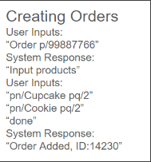

Strack.io is a **desktop app for Homemade food sellers to manage contacts of their customers, optimized for use via a Command Line Interface** (CLI) while still having the benefits of a Graphical User Interface (GUI). If you can type fast, Strack.io can get your contact management tasks done faster than traditional GUI apps.

* Table of Contents
{:toc}

--------------------------------------------------------------------------------------------------------------------

## Quick start

1. Ensure you have Java `11` or above installed in your Computer.

1. Download the latest `addressbook.jar` from [here](https://github.com/se-edu/addressbook-level3/releases).

1. Copy the file to the folder you want to use as the _home folder_ for your AddressBook.

1. Open a command terminal, `cd` into the folder you put the jar file in, and use the `java -jar addressbook.jar` command to run the application. 
   A GUI similar to the below should appear in a few seconds. Note how the app contains some sample data. 
   

1. Type the command in the command box and press Enter to execute it. e.g. typing **`help`** and pressing Enter will open the help window. 
   Some example commands you can try:

   * `list` : Lists all contacts.

   * `add n/John Doe p/98765432 e/johnd@example.com a/John street, block 123, #01-01` : Adds a contact named `John Doe` to the Address Book.

   * `delete 3` : Deletes the 3rd contact shown in the current list.

   * `clear` : Deletes all contacts.

   * `exit` : Exits the app.

1. Refer to the [Features](#features) below for details of each command.

--------------------------------------------------------------------------------------------------------------------

## Features

**:information_source: Notes about the command format:** 

* Words in `UPPER_CASE` are the parameters to be supplied by the user. 
  e.g. in `add n/NAME`, `NAME` is a parameter which can be used as `add n/John Doe`.

* Items in square brackets are optional. 
  e.g `n/NAME [t/TAG]` can be used as `n/John Doe t/friend` or as `n/John Doe`.

* Items with `…`​ after them can be used multiple times including zero times. 
  e.g. `[t/TAG]…​` can be used as ` ` (i.e. 0 times), `t/friend`, `t/friend t/family` etc.

* Parameters can be in any order. 
  e.g. if the command specifies `n/NAME p/PHONE_NUMBER`, `p/PHONE_NUMBER n/NAME` is also acceptable.

* Extraneous parameters for commands that do not take in parameters (such as `help`, `list`, `exit` and `clear`) will be ignored. 
  e.g. if the command specifies `help 123`, it will be interpreted as `help`.

* If you are using a PDF version of this document, be careful when copying and pasting commands that span multiple lines as space characters surrounding line-breaks may be omitted when copied over to the application.

### Viewing help : `help`

You can show a message explaining how to access the help page.

Format: `help`

### Adding a customer: `add`

You can add a customer to your address book.

Format: `add n/NAME p/PHONE_NUMBER e/EMAIL a/ADDRESS [t/TAG]…​`

:bulb: **Tip:**
A person can have any number of tags (including 0)

Examples:
* `add n/John Doe p/98765432 e/johnd@example.com a/John street, block 123, #01-01`
* `add n/Betsy Crowe t/friend e/betsycrowe@example.com a/Newgate Prison p/1234567 t/criminal`

### Listing all customers and orders : `list`

You can show a list of all customers and orders in your address book.

Format: `list`

### Editing a person : `edit`

You can edit an existing customer in your address book.

Format: `edit c/CUSTOMER_ID [n/NAME] [p/PHONE] [e/EMAIL] [a/ADDRESS] [t/TAG]…​`

* Edits the person of the specified `CUSTOMER_ID`. The customer_id refers to the number shown in the customers's contact under "customer id". The customer id **must be a positive integer** 1, 2, 3, …​
* At least one of the optional fields must be provided.
* Existing values will be updated to the input values.
* When editing tags, the existing tags of the customer will be removed i.e adding of tags is not cumulative.
* You can remove all the person’s tags by typing `t/` without
    specifying any tags after it.

Examples:
*  `edit c/1 p/91234567 e/johndoe@example.com` Edits the phone number and email address of the person with customer_id of 1 to be `91234567` and `johndoe@example.com` respectively.
*  `edit c/2 n/Betsy Crower t/` Edits the name of the person with customer_id of 2 to be `Betsy Crower` and clears all existing tags.

### Locating customers and orders: `find`

You can find customers based on name, phone number, address or email and find orders based on order index.

Format: `find [n/NAME] [a/ADDRESS] [p/PHONE_NUMBER] [e/EMAIL] [o/ORDER_ID]`

* The search is case-insensitive. e.g `hans` will match `Hans`
* The order of the keywords does not matter. e.g. `Hans Bo` will match `Bo Hans`
* At least one of the optional fields must be provided and only choose one field.
* You can add different keywords for one chosen field and customers with any matching keyword will be included.
* Only full words will be matched e.g. `Han` will not match `Hans`
* Persons matching at least one of the specified information will be returned (i.e. `OR` search).
  Examples:
* `n/Hans n/Bo` will return `Hans Gruber`, `Bo Yang`

Examples:
* `find n/John` returns `john` and `John Doe`
* `find n/alex n/John` returns `Alex`, `john` and `John Doe` 
* `find a/Lorong` returns customers with address that includes `Lorong`
* `find p/85012345 p/12345678` returns customer with phone number of `85012345` and `12345678`
* `find o/19 o/23` returns `Order 19` and `Order 23`.

### Deleting a customer : `delete`

You can delete the specified customer from your address book.

Format: `delete c/CUSTOMER_ID`

* Deletes the customer of the specified `CUSTOMER_ID`.
* The customer_id refers to the number shown under customer id in the displayed customer contact.
* The customer_id **must be a positive integer** 1, 2, 3, …​

Examples:
* `list` followed by `delete c/2` deletes the person with customer_id of `2` in the address book.
* `find Betsy` followed by `delete c/1` deletes the person with customer_id of `1` in the results of the `find` command.

### Creating of orders : `order`

You can create and assign an order to a specified customer in the address book.

Format: `order p/PHONE_NUMBER`

* Orders are assigned to person with specified `PHONE_NUMBER`.
* Strack will prompt `Input Products`.
* Follow up with products to be added to the order using the following format. Format: `pn/PRODUCT_NAME pq/PRODUCT_QUANTITY`.
* This can be repeated as many times as necessary.

Examples:
* `order p/99887766` will create an order for person with phone number `99887766` followed by `pn/Cupcake pq/2` and `pn/Cookie pq/2` ending with `done`  

 

### Editing of orders `edit`

You can edit an existing order of a specific customer in your address book.

Format: `edit o/ORDER_ID pn/PRODUCT_NAME pq/PRODUCT_QUANTITY`

* `ORDER_ID` is a unique number for each order.
* The order id refers to the number shown under order id in the displayed customer's contact.
* Products are edited based on `PRODUCT_NAME`.
* To remove product from order, specify `PRODUCT_QUANTITY` as `0`.

Example:
* `edit o/1 pn/Chicken Pie pq/2 pn/Macaron pq/6` will edit the order with order id of 1 and change `Chicken Pie` quantity to `2` and `Macaron` quantity to `6`.

### Cancelling/Completion of orders: `delete`

You can remove an ongoing order in your address book.

Format: `cancel ORDER_ID`

* `ORDER_ID` refers to the number shown under order id in the displayed persons contact.

Example:
* `delete 19` will delete order with `ORDER_ID` of `19`.

### Clearing all entries : `clear`

You can clear all entries from your address book.

Format: `clear`

### Exiting the program : `exit`

You can exit the program using a command.

Format: `exit`

### Saving the data

Strack.io data are saved in the hard disk automatically after any command that changes the data. There is no need to save manually.

### Editing the data file

Strack.io data are saved automatically as a JSON file `[JAR file location]/data/Strack.io.json`. Advanced users are welcome to update data directly by editing that data file.

:exclamation: **Caution:**
If your changes to the data file makes its format invalid, Strack.io will discard all data and start with an empty data file at the next run. Hence, it is recommended to take a backup of the file before editing it. 
Furthermore, certain edits can cause Strack.io to behave in unexpected ways (e.g., if a value entered is outside of the acceptable range). Therefore, edit the data file only if you are confident that you can update it correctly.

### Archiving data files `[coming in v2.0]`

_Details coming soon ..._

--------------------------------------------------------------------------------------------------------------------

## FAQ

**Q**: How do I transfer my data to another Computer? 
**A**: Install the app in the other computer and overwrite the empty data file it creates with the file that contains the data of your previous Strack.io home folder.

--------------------------------------------------------------------------------------------------------------------

## Known issues

1. **When using multiple screens**, if you move the application to a secondary screen, and later switch to using only the primary screen, the GUI will open off-screen. The remedy is to delete the `preferences.json` file created by the application before running the application again.

--------------------------------------------------------------------------------------------------------------------

## Command summary

Action | Format, Examples
--------|------------------
**Add** | `add n/NAME p/PHONE_NUMBER e/EMAIL a/ADDRESS [t/TAG]…​`   e.g., `add n/James Ho p/22224444 e/jamesho@example.com a/123, Clementi Rd, 1234665 t/friend t/colleague`
**Clear** | `clear`
**Delete customer** | `delete c/CUSTOMER_ID`  e.g., `delete c/3`
**Edit customer** | `edit c/CUSTOMER_ID [n/NAME] [p/PHONE_NUMBER] [e/EMAIL] [a/ADDRESS] [t/TAG]…​`  e.g.,`edit 2 n/James Lee e/jameslee@example.com`
**Find** | `find [n/NAME] [p/PHONE_NUMBER] [a/ADDRESS] [e/EMAIL] [o/ORDER_ID]`  e.g., `find James Jake`
**List contacts** | `list`
**List orders** | `list orders`
**Create order** | `order`
**Cancel order** | `cancel ORDER_ID`
**Edit order** | `edit o/ORDER_ID pn/PRODUCT_NAME pq/PRODUCT_QUANTITY`
**Help** | `help`
