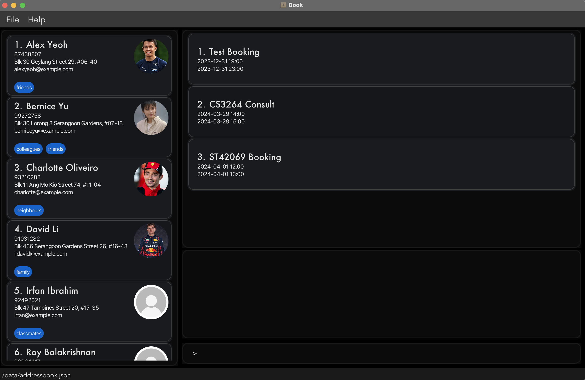

**Dook** is an application to help **NUS School of Computing (SoC) students find contacts within SoC** and **book consultation slots with their Professors and Teaching Assistants**. 

* For a quick start, checkout our [_Quick Start_ section](UserGuide.md).
* To contribute, checkout the [**Developer Guide**](DeveloperGuide.md).

**Acknowledgements**

* This project is based on the [AddressBook-Level3](https://github.com/se-edu/addressbook-level3) project created by the [SE-EDU initiative](https://se-education.org))
* Libraries used: [JavaFX](https://openjfx.io/), [Jackson](https://github.com/FasterXML/jackson), [JUnit5](https://github.com/junit-team/junit5)
