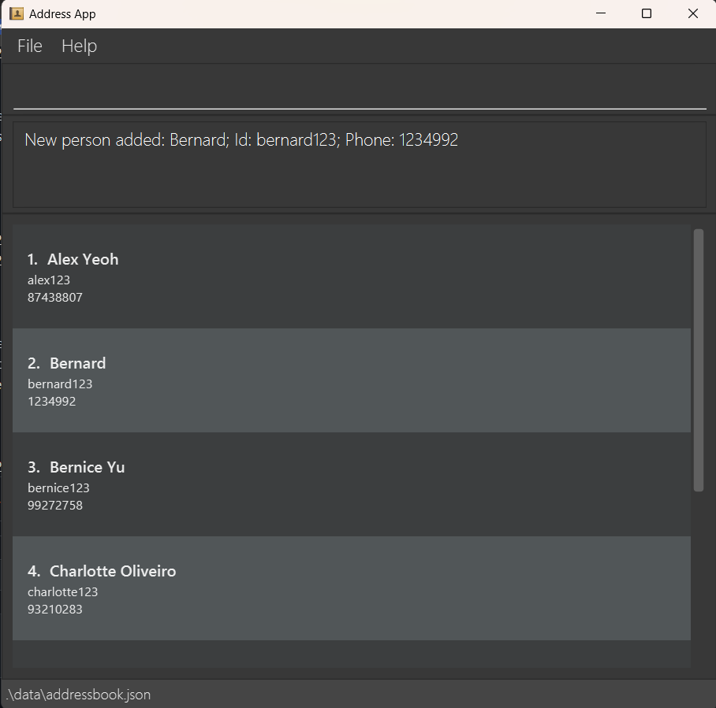

# **Hi:Re** :book:

***

**Hi:Re is a one-stop Human-Resource (HR) application for** 
<tooltip content="This is especially so for HR managers of start-ups and small and medium-sized enterprises (SMEs) who have yet to utilise an HR application. We also hope to benefit non-profit organisations and companies with no financial settings for an HR application.">
  <b href="">HR managers.</b>
</tooltip>
 

While it has a GUI, most of the user interactions happen using a CLI (Command Line Interface).

***

<table class="top-table" border="0">
 <tr>
    <td style="width: 800px;">
      <h2>Getting started</h2>
      Learn how to set up your Hi:Re.   
      <a href="UserGuide.html#quick-start">Quick Start ></a>
    </td>
    <td style="width: 900px;">
      
    </td>
 </tr>
</table>

***

<table class="top-table" border="0">
 <tr>
    <td align="center" style="width: 250px;">
       
      
    </td>
    <td>
      <h2>Develop your own Hi:Re</h2>
      Access our source code to develop your own Hi:Re to suit your needs.   
      <a href="DeveloperGuide.html">Developer Guide ></a>
    </td>
 </tr>
</table>

***

**Acknowledgements**

* Libraries used: [JavaFX](https://openjfx.io/), [Jackson](https://github.com/FasterXML/jackson), [JUnit5](https://github.com/junit-team/junit5)
