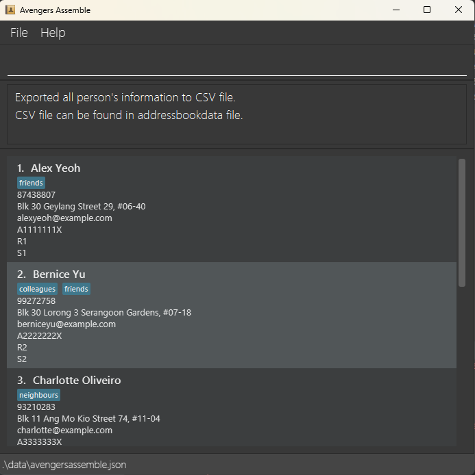
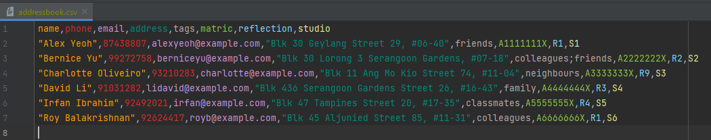
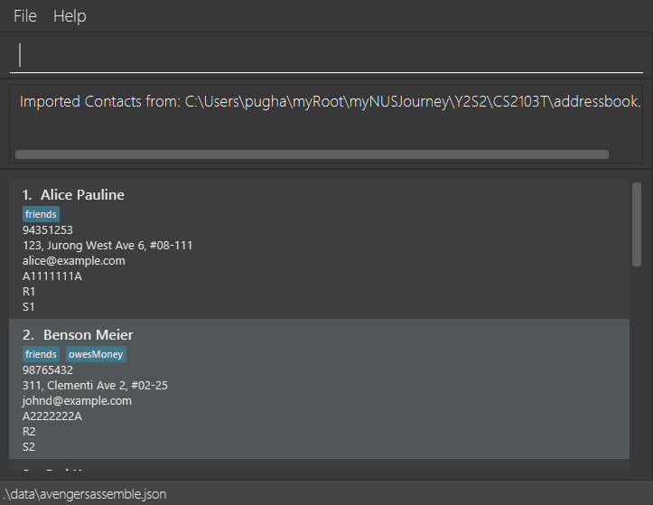
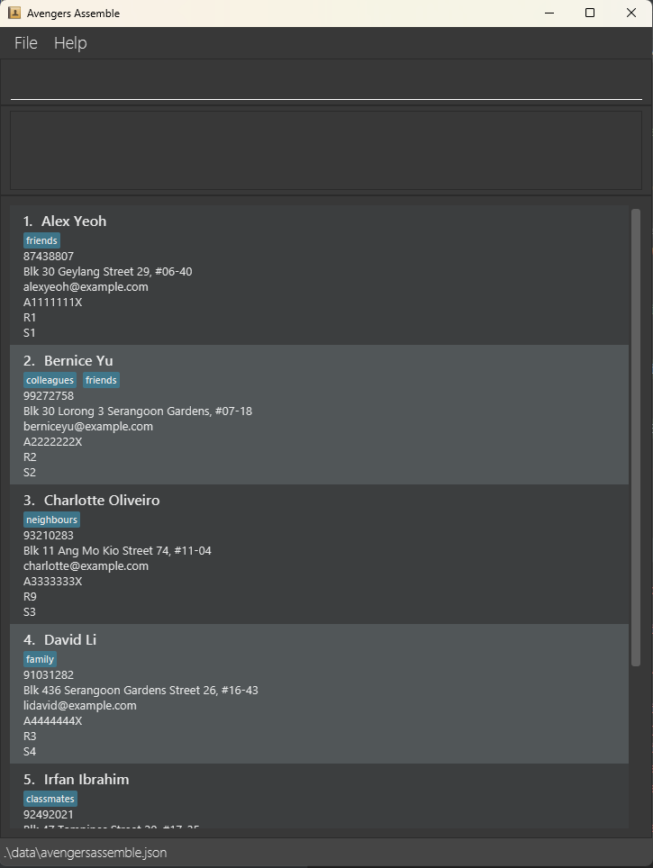

# Avengers Assemble v1.2 Release Notes

With our additions, we are confident that Avengers Assemble has a MVP. Although some features require refinement, we have implemented enough features with sufficient quality to ensure a working product for head TAs for CS1101S.
## What's New
### 1. Export Feature
Avengers Assemble now supports exporting data of up to 500 contacts to a CSV file!

1. Simply type `export` to export a CSV file of the contacts. 

2. Once this message shows, the CSV is available for external use by the head TA.

3. An example of the exported CSV file.

### 2. Import Feature
Avengers Assemble now supports importing data of up to 500 contacts stored in a csv file

1. Simply type `import i/<filePath>` where filePath is the absolute path of your csv file.
2. Once this message shows, imported contacts will be reflected in addressBook

### 3. Find Feature
Avengers Assemble now supports finding contacts by their various details, and not just their names!

1. Simply type `find` to find a contact by their details, followed by the field you want to search up. For example, the screenshot below shows finding contacts with an address containing `30`.

2. The result will show all contacts with an address containing `30`.

### 4. Copy Feature
Avengers Assemble also supports copying the emails of any specific group of contacts in the list into your clipboard!

1. Use the `find` command to search for the people whose emails you would like to copy.
2. Type `copy` to copy all the emails of currently displayed contacts into your clipboard.
3. All emails will be copied into your clipboard!

### 5. New Fields Added
To further support head TAs keeping track of the various reflections and studios happening in the ever hectic CS1101S, Avengers Assemble now supports adding the reflection `r/` and studio `s/` fields to contacts!

### 6. Bug Fixes
Previously, the existing codebase checked for duplicate contacts by their name. However, this was not sufficient as there could be multiple contacts with the same name which is especially likely for a large course like CS1101S. This has been fixed by checking for the duplicates by their email.

